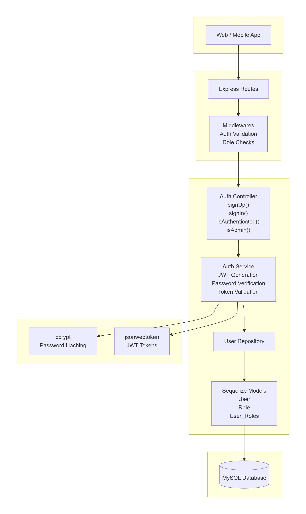

# Authentication Service

Authentication microservice for a JavaScript backend that provides secure user login, role-based access control, and support for user lifecycle flows. This repository includes Sequelize models, REST controllers, service logic, request validation middleware, database migrations, and seeders.

## Overview

This service is designed to manage user credentials and authorization responsibilities for a larger application. It supports:

- user registration and login flows
- password hashing and secure authentication
- role assignment and role-based authorization
- structured API endpoints for user management
- Sequelize migrations and seed data for roles

## Architecture

The service is built with a layered architecture:

- `models/` contains Sequelize definitions for `User` and `Role`
- `controllers/` contains request handlers for authentication and user management
- `services/` contains business logic for user operations and role handling
- `middlewares/` validates incoming requests and protects routes
- `repository/` abstracts database operations from controller logic
- `migrations/` and `seeders/` manage database schema and initial role data

The repository includes an architecture diagram to explain how authentication, role validation, and request routing are connected.



## Installation

1. Install dependencies:

```bash
npm install
```

2. Configure your database connection in `src/config/config.json` or use environment variables as required.

## Run

Start the service locally:

```bash
npm start
```

## Development Commands

Generate Sequelize models with this command when adding new entities:

```bash
npx sequelize model:generate --name User --attributes email:string,password:string
```

## Project Structure

- `src/index.js` � application entry point
- `src/config/serverConfig.js` � server configuration
- `src/controllers/` � route handlers
- `src/services/` � domain logic
- `src/repository/` � database access layer
- `src/middlewares/` � request validation and authorization
- `src/models/` � Sequelize model definitions
- `src/migrations/` � schema migrations
- `src/seeders/` � seed data for roles and initial state
- `src/utils/` � application error handling utilities

## Notes

Keep the service modular and maintainable by separating validation, controllers, and data access. Use the existing middleware pattern to protect routes and validate authentication tokens.
